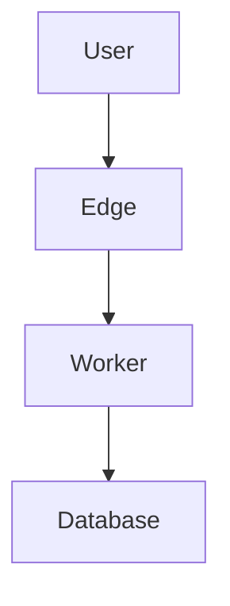

# Contributing to the Fenod Stack

Thank you for your interest in improving the Fenod Stack! This document explains how to propose changes, add new technologies, or update existing recommendations.

---

## Table of Contents

- [Philosophy](#philosophy)
- [How to Contribute](#how-to-contribute)
- [Proposing New Technologies](#proposing-new-technologies)
- [Proposing Removals](#proposing-removals)
- [Updating Documentation](#updating-documentation)
- [Review Process](#review-process)
- [Stack Principles](#stack-principles)

---

## Philosophy

The Fenod Stack is:
- **Opinionated** - We make clear technology choices
- **Pragmatic** - Choices are based on real-world experience
- **Edge-first** - Optimized for Cloudflare's global network
- **Type-safe** - TypeScript throughout
- **Community-driven** - Open to improvements from users

We value **stability over novelty** while staying **modern and performant**.

---

## How to Contribute

### 1. Documentation Improvements

For typos, clarifications, or additional examples:

1. Fork the repository
2. Make your changes
3. Submit a pull request
4. No formal proposal needed for doc-only changes

### 2. Minor Updates

For version updates or small tweaks:

1. Update the relevant files
2. Update `docs/versions.md` if changing versions
3. Update `STACK_CHANGELOG.md`
4. Submit a pull request with clear description

### 3. Major Changes

For new technologies or significant changes:

1. **Create an RFC** (see below)
2. **Discuss in GitHub Discussions** before submitting
3. **Create ADR** if approved
4. **Update all affected documentation**
5. **Update version matrix**

---

## Proposing New Technologies

### When to Propose

Consider proposing a new technology when:
- ✅ Current solution has significant limitations
- ✅ New technology solves a pain point
- ✅ Technology is production-ready and stable
- ✅ Aligns with stack principles (see below)
- ✅ Has active maintenance and community

### When NOT to Propose

❌ Don't propose if:
- Technology is pre-alpha or experimental
- Duplicates existing stack functionality
- Requires significant re-architecture
- Has no clear advantage over current solution
- Is a personal preference without objective benefits

### Proposal Template

Create a new GitHub Discussion using this template:

```markdown
# [PROPOSAL] Add [Technology Name]

## Summary
One-paragraph summary of what you're proposing and why.

## Current Problem
What problem does this solve? What are the limitations of the current approach?

## Proposed Solution
**Technology:** [Name and link]
**Version:** [Stable version number]
**License:** [License type]

### Key Benefits
1. [Benefit 1]
2. [Benefit 2]
3. [Benefit 3]

### Potential Drawbacks
1. [Drawback 1]
2. [Drawback 2]

## Comparison with Alternatives

| Criteria | Proposed | Current | Alternative |
|----------|----------|---------|-------------|
| Performance | ... | ... | ... |
| Bundle Size | ... | ... | ... |
| DX | ... | ... | ... |
| Community | ... | ... | ... |
| Edge Support | ... | ... | ... |

## Integration Plan

How would this integrate with the existing stack?

```typescript
// Example code showing integration
```

## Migration Path

If replacing existing technology, how would existing projects migrate?

1. Step 1
2. Step 2
3. ...

## Questions for Reviewers

1. Question 1?
2. Question 2?

## References

- [Official Documentation](...)
- [GitHub Repository](...)
- [Relevant Articles](...)
```

### Evaluation Criteria

Proposals are evaluated on:

1. **Alignment with Principles** (40%)
   - Edge runtime compatibility
   - Type safety
   - Developer experience
   - Performance

2. **Maturity & Stability** (25%)
   - Production readiness
   - Active maintenance
   - Community size
   - Breaking change frequency

3. **Practical Benefits** (20%)
   - Solves real problems
   - Clear advantages
   - Cost considerations

4. **Integration Complexity** (15%)
   - Migration path clarity
   - Learning curve
   - Documentation quality

**Minimum Score:** 70% to be considered for adoption

---

## Proposing Removals

### Deprecation Process

To propose removing a technology:

1. **Create GitHub Discussion** titled `[DEPRECATION] Remove [Technology]`
2. **Provide Rationale:**
   - Why it should be removed
   - What replaces it
   - Migration path for existing users

3. **Deprecation Timeline:**
   ```
   Month 1: Mark as deprecated
   Month 2-3: Migration guide published
   Month 4-6: Support period (answer questions)
   Month 7+: Remove from stack
   ```

### Deprecation Template

```markdown
# [DEPRECATION] Remove [Technology Name]

## Reason for Deprecation
Why should this be removed?

## Replacement
What should users use instead?

## Impact Assessment
- How many projects use this?
- What's the migration effort?
- Any blockers?

## Migration Guide
Step-by-step migration instructions

## Support Timeline
- [Date]: Mark as deprecated
- [Date]: Migration guide published
- [Date]: End of support
- [Date]: Removal from stack
```

---

## Updating Documentation

### Documentation Standards

- **Clear & Concise** - Get to the point quickly
- **Code Examples** - Show, don't just tell
- **Updated** - Keep versions current
- **Accurate** - Test all code examples

### Documentation Structure

```
docs/
├── architecture.md          # System design
├── development-strategy.md  # Workflow guide
├── local-development.md     # Environment setup
├── troubleshooting.md       # Common issues
├── versions.md              # Version matrix
├── decisions/               # ADRs
│   ├── README.md
│   ├── 001-*.md
│   └── ...
```

### Adding New Documentation

1. Determine correct location
2. Follow existing formatting
3. Add to Table of Contents in README.md
4. Update relevant index files
5. Add examples and diagrams where helpful

### Mermaid Diagrams

We use Mermaid.js for diagrams. Example:



**Guidelines:**
- Keep diagrams simple and focused
- Use consistent styling
- Include legend if needed
- Test rendering on GitHub

---

## Review Process

### 1. Discussion Phase (1-2 weeks)

- Post in GitHub Discussions
- Community feedback
- Technical team review
- Refinement based on feedback

### 2. Proposal Approval

Requires:
- ✅ 2+ technical team approvals
- ✅ No blocking objections
- ✅ Addresses all feedback
- ✅ Meets evaluation criteria (70%+)

### 3. Implementation

For approved proposals:

1. **Create ADR** in `docs/decisions/`
2. **Update Documentation:**
   - README.md (if adding to stack)
   - docs/versions.md
   - Relevant guides
3. **Update STACK_CHANGELOG.md**
4. **Create migration guide** (if replacing existing tech)

### 4. Announcement

- Post in Discussions
- Update README with "What's New"
- Tweet/share if significant

---

## Stack Principles

All proposals must align with these principles:

### 1. **Cloudflare-First** ☁️

- Must run on Cloudflare Workers or Pages
- No Node.js-specific dependencies
- Small bundle size (<1MB worker limit)
- Edge runtime compatible

**Example:**
```typescript
// ✅ Good - Web standard APIs
export default {
  async fetch(request: Request): Promise<Response> {
    return new Response('Hello')
  }
}

// ❌ Bad - Node.js specific
import fs from 'fs'
fs.readFileSync('file.txt')
```

### 2. **Type Safety** 🔒

- First-class TypeScript support
- Strong type inference
- Compile-time error catching
- No `any` types in public APIs

**Example:**
```typescript
// ✅ Good - Fully typed
export function getCustomer(id: number): Promise<Customer> {
  return db.select().from(customers).where(eq(customers.id, id))
}

// ❌ Bad - Weak types
export function getCustomer(id: any): Promise<any> {
  return db.select().from(customers)
}
```

### 3. **Modern DX** ✨

- Excellent documentation
- Clear error messages
- Fast feedback loops
- Minimal configuration

### 4. **Performance** ⚡

- Sub-1s cold starts
- Small bundle sizes
- Efficient runtime
- Edge-optimized

### 5. **Simplicity** 🎯

- Minimal abstraction layers
- Clear mental models
- Few dependencies
- Easy to debug

---

## Code of Conduct

### Be Respectful

- Constructive feedback
- Assume good intentions
- No personal attacks
- Welcoming to newcomers

### Be Professional

- Clear communication
- Data-driven arguments
- Acknowledge tradeoffs
- Admit when unsure

### Be Collaborative

- Open to feedback
- Help others
- Share knowledge
- Celebrate contributions

---

## Communication Channels

- **GitHub Discussions** - Stack proposals, questions
- **GitHub Issues** - Documentation bugs, typos
- **Pull Requests** - Code and documentation changes

---

## Recognition

Contributors will be:
- Listed in CONTRIBUTORS.md
- Mentioned in STACK_CHANGELOG.md
- Acknowledged in relevant documentation

Significant contributions may be featured in:
- README.md
- Twitter/social media
- Blog posts

---

## Getting Help

**Questions?**
- Ask in GitHub Discussions
- Check existing documentation
- Review past proposals

**Not sure if proposal is ready?**
- Start informal discussion first
- Get feedback before formal proposal
- Prototype integration

---

## Examples of Good Proposals

### ✅ Example 1: Adding Better Auth

**Why it was approved:**
- Solved real authentication pain point
- Better edge compatibility than alternatives
- Clear migration path from NextAuth
- Active development and good docs
- Aligned with all stack principles

### ✅ Example 2: Adding TanStack Start

**Why it was approved:**
- Type-safe routing superior to alternatives
- Framework-agnostic (no vendor lock-in)
- Edge-first design
- From trusted TanStack ecosystem
- Clear advantages over Next.js for our use case

### ❌ Example 3: Adding Prisma (Rejected)

**Why it was rejected:**
- Poor edge runtime support
- Requires code generation step
- Large bundle size
- Drizzle already solves the problem
- No clear advantage for our use case

---

## Quick Checklist

Before submitting a proposal:

- [ ] Technology is production-ready (v1.0+)
- [ ] Works on Cloudflare Workers/Pages
- [ ] Has TypeScript support
- [ ] Actively maintained
- [ ] Solves a real problem
- [ ] Migration path is clear
- [ ] Documentation is good
- [ ] Community is healthy
- [ ] Evaluated against alternatives
- [ ] Aligns with stack principles

---

Thank you for contributing to the Fenod Stack! 🎉

**Questions?** Open a GitHub Discussion.

**Maintainers:** See `MAINTAINERS.md` for additional responsibilities.
