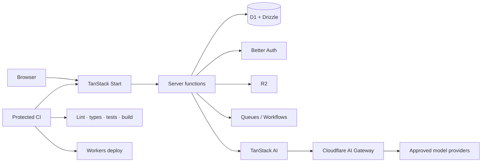
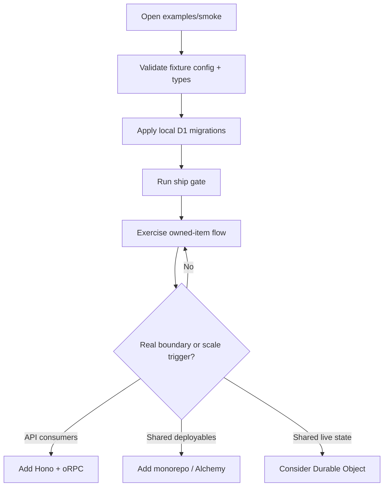

<p align="center">
  
</p>

# Fenod stack

Opinionated defaults for building full-stack TypeScript products on Cloudflare Workers.

**Start small. Keep the platform boring. Give agents context, not production authority.**

## The short version

| Need | Default |
| --- | --- |
| App | TanStack Start on Cloudflare Workers |
| Data | Drizzle + D1 |
| Auth | Better Auth |
| UI | Tailwind v4 + shadcn/ui; install requested official components/blocks with `pnpm dlx shadcn@latest add <item>` |
| API | Start server functions first; Hono + oRPC when a real API boundary exists |
| Files / async work | R2 / Queues / Workflows |
| AI | TanStack AI + Cloudflare AI Gateway |
| Quality | Oxlint + @shadcn/lint + Oxfmt + TypeScript 7 + Vitest + Playwright when needed |
| Secrets | Infisical + Worker secrets |
| Deploy | Git push → protected CI → Workers |

## How the pieces fit



## Try the application reference

The living reference is intentionally one package, not a starter monorepo.

**Not a production-ready template yet:** the item workflow is authenticated and owner-scoped, but there is no portable export, CI browser test or validated deployed secret/config startup. S2 now proves fixture-only Varlock injection locally; it does not prove Doppler or deployment. See the [September audit](plans/009-agent-first-audit.md) and [starter plan](plans/010-maintained-starter.md). Wait for S3 instead of copying a working tree.

```bash
cd examples/smoke
pnpm install --frozen-lockfile
pnpm config:check
pnpm cf-types
pnpm db:local
pnpm ship
pnpm dev
```

No vault account, credential or local env file is needed. Add Hono + oRPC only if a real API boundary is needed ([recipe](docs/recipes.md)). Remote scripts fail closed until separately approved S4/S5 work.



For a content or marketing site, use the [Astro recipe](docs/astro.md) and [standalone Astro reference](examples/astro/README.md).

## UI rule

When you want shadcn, use the real item, not a similar implementation:

```bash
pnpm dlx shadcn@latest add <item>
```

This applies to primitives and blocks, including the default sidebar. Customize after it is installed so future shadcn updates remain easy.

The smoke reference also runs **`@shadcn/lint` through Oxlint**. Its `no-restyle` policy keeps component variants authoritative while allowing page layout. See the [UI lint recipe](docs/recipes.md#verify-design-system-usage).

## What we deliberately do not start with

- no day-one monorepo or Alchemy;
- no Redis, Prisma, Express, tRPC, or new Pages projects;
- no repository/hexagonal layers without real pain;
- no production deploys, migrations, DNS, or secrets from agent sessions.

Grow only when the trigger is real. See [the Stack Contract](docs/stack-contract.md).

## Humans and agents

Humans: start with this README, then [examples/README.md](examples/README.md) and [examples/smoke/STACK.md](examples/smoke/STACK.md).

Agents: start with [AGENTS.md](AGENTS.md), then use [agent-context.json](agent-context.json) or [llms.txt](llms.txt) to route by task. Read [llms-full.txt](llms-full.txt) only when deeper context is needed. Agent operation rules live in [docs/agent-factory.md](docs/agent-factory.md).

## Checks

```bash
pnpm check       # read-only: fails on stale generated context
pnpm test        # generator determinism and negative checks
pnpm --dir examples/smoke ship
pnpm --dir examples/astro ship
# Higher-risk smoke changes:
pnpm --dir examples/smoke cf-types
pnpm --dir examples/smoke build
```

After editing agent-context sources, run `pnpm llms:build` and review the generated diff before checking. The [audit](plans/009-agent-first-audit.md) separates verified changes from pending migrations; [agent evaluations](docs/agent-evals.md) describes the bounded Jev pilot.

Law: [docs/stack-contract.md](docs/stack-contract.md). Security: [docs/security-model.md](docs/security-model.md).
