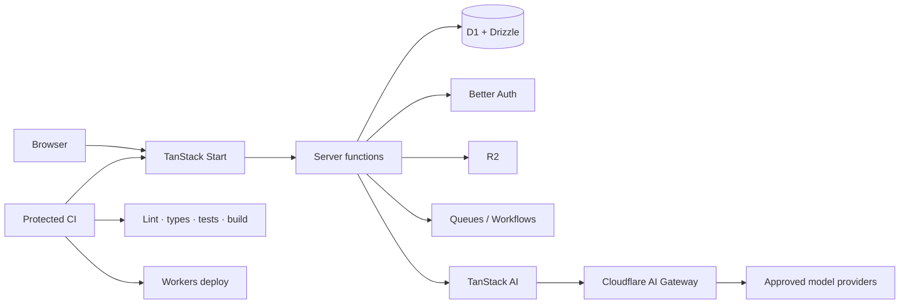
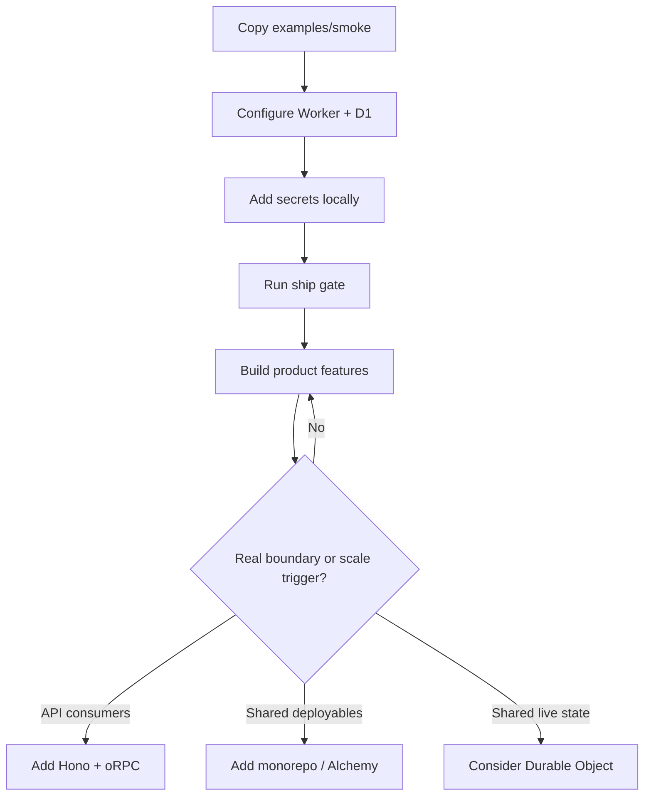

# Fenod stack

Opinionated defaults for building full-stack TypeScript products on Cloudflare Workers.

**Start small. Keep the platform boring. Give agents context, not production authority.**

## The short version

| Need | Default |
| --- | --- |
| App | TanStack Start on Cloudflare Workers |
| Data | Drizzle + D1 |
| Auth | Better Auth |
| UI | Tailwind v4 + shadcn/ui |
| API | Start server functions first; Hono + oRPC when a real API boundary exists |
| Files / async work | R2 / Queues / Workflows |
| AI | TanStack AI + Cloudflare AI Gateway |
| Quality | Oxlint + Oxfmt + tsgo + Vitest + Playwright when needed |
| Secrets | Infisical + Worker secrets |
| Deploy | Git push → protected CI → Workers |

## How the pieces fit



## Start a product

Use the living reference. It is intentionally one package, not a starter monorepo.

```bash
cp -R examples/smoke ../my-app
cd ../my-app
rm -rf node_modules .wrangler dist
# Rename package.json and wrangler.jsonc names.
pnpm install
pnpm dlx wrangler d1 create my-app
# Put the returned database_id in wrangler.jsonc.
cp .dev.vars.example .dev.vars   # or use Infisical
pnpm db:local
pnpm ship
pnpm dev
```

Then remove unused demo routes and build the product. Keep the reference shape until a real trigger requires more structure.



## What we deliberately do not start with

- no day-one monorepo or Alchemy;
- no Redis, Prisma, Express, tRPC, or new Pages projects;
- no repository/hexagonal layers without real pain;
- no production deploys, migrations, DNS, or secrets from agent sessions.

Grow only when the trigger is real. See [the Stack Contract](docs/stack-contract.md).

## Humans and agents

Humans: start with this README, then [examples/README.md](examples/README.md) and [examples/smoke/STACK.md](examples/smoke/STACK.md).

Agents: start with [AGENTS.md](AGENTS.md), then use [agent-context.json](agent-context.json) or [llms.txt](llms.txt) to route by task. Read [llms-full.txt](llms-full.txt) only when deeper context is needed. Agent operation rules live in [docs/agent-factory.md](docs/agent-factory.md).

## Checks

```bash
pnpm check
pnpm check:context
cd examples/smoke && pnpm ship
# Higher-risk reference changes:
pnpm cf-types && pnpm build
```

Law: [docs/stack-contract.md](docs/stack-contract.md). Security: [docs/security-model.md](docs/security-model.md).
