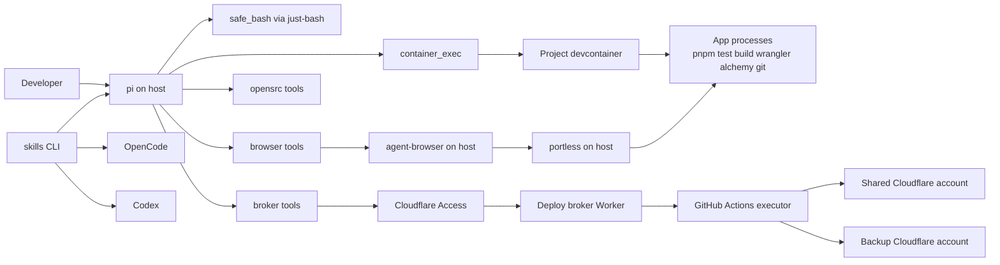
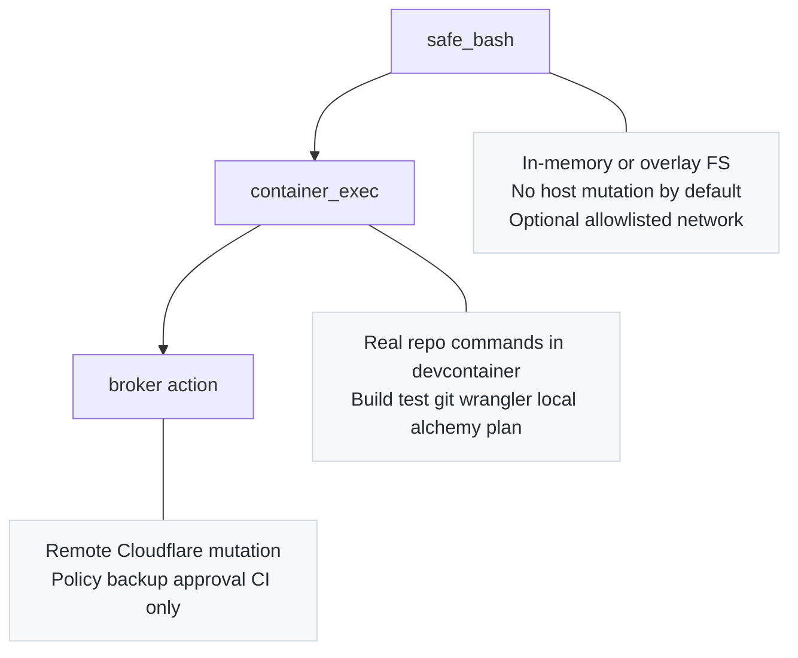
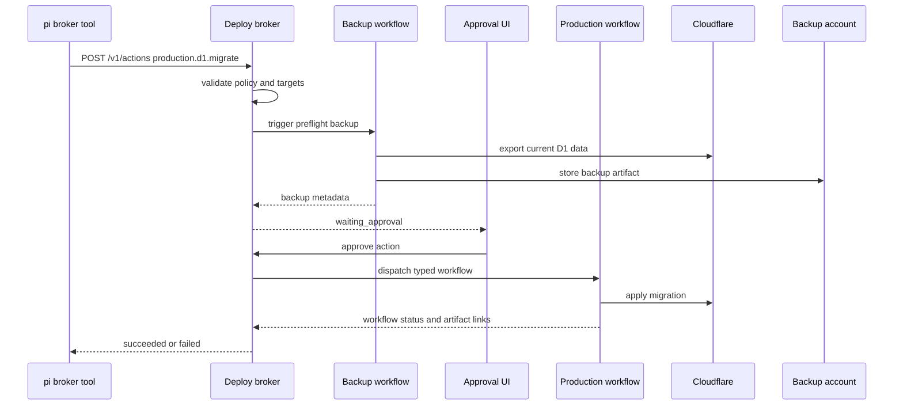
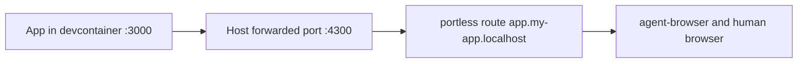
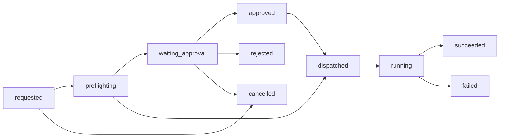

# Agent Platform Plan

This guide describes the recommended Fenod platform for local AI-assisted development with `pi`, `OpenCode`, `Codex`, Cloudflare, and Alchemy. The target is a setup that feels autonomous for day-to-day work, stays project-scoped on a shared Cloudflare account, and keeps production changes behind backup, approval, and audit boundaries.

## Executive Summary

- Use `pi` as the primary local harness.
- Keep `OpenCode` and `Codex` as optional secondary agents that reuse the same project docs and skills.
- Run `pi`, `portless`, `agent-browser`, `skills`, and `opensrc` on the host machine.
- Run code, tests, `git`, `wrangler`, `alchemy`, and app processes inside a project devcontainer.
- Disable the built-in `bash` tool in `pi` for v1.
- Make `safe_bash` backed by `just-bash` the default shell tool for low-trust command execution.
- Route all real project commands through `container_exec` into the devcontainer.
- Route all Cloudflare mutations through an Access-protected deploy broker.
- Let preview and staging actions auto-approve by policy when safe.
- Require backup, human approval, and GitHub Actions execution for production-dangerous actions.
- Store backups in a separate Cloudflare backup account from day one if possible.
- Start with an API-first Worker pilot that includes D1, then promote the pattern into a full-stack template.

## Recommended Decisions

### Approval UX

Use a small Access-protected web UI for approvals.

Why:

- faster than approval-via-comments
- easier to audit and explain
- clearer action summaries for migrations, DNS, KV, and tunnel changes
- easier to attach backup metadata and workflow run links

GitHub comments can still be added later as a secondary interface.

### Backup Isolation

Use a separate Cloudflare backup account from day one.

Why:

- better blast-radius isolation than same-account backups
- safer if the main shared account token or policies are misconfigured
- cleaner long-term story for retention and restore drills

Fallback if needed:

- start with a dedicated backup bucket in the shared account
- treat it as temporary
- move to a separate backup account before production adoption spreads broadly

### First Pilot

Start with an API-first Worker using D1.

Why:

- exercises the broker, backup, and migration flow early
- keeps the first implementation surface smaller than a full-stack app
- still validates Alchemy, Wrangler, D1, and Cloudflare policy boundaries

After that, promote the same platform into a full TanStack Start template.

## Architecture At A Glance



## Trust Boundaries

```text
+---------------- Host machine ----------------+
| pi | portless | agent-browser | opensrc      |
|                                          ^    |
| safe_bash: isolated, in-memory/overlay   |    |
| no direct prod Cloudflare token          |    |
+-------------------------------------------|----+
                                            |
                                            v
+---------------- Devcontainer ----------------+
| repo files | pnpm | git | wrangler | alchemy |
| local builds, tests, local dev servers      |
| no prod Cloudflare token                     |
+----------------------------------------------+
                                            |
                                            v
+-------------- Broker + CI control plane ----------------+
| Access auth | policy validation | backup checks         |
| human approval | audit trail | GitHub Actions dispatch |
+---------------------------------------------------------+
                                            |
                                            v
+------------- Cloudflare production -------------+
| shared main account | separate backup account   |
+-------------------------------------------------+
```

## Execution Tiers



## What Runs Where

| Concern | Host | Devcontainer | Broker | GitHub Actions |
|--------|------|--------------|--------|----------------|
| `pi` session and extensions | yes | no | no | no |
| `safe_bash` via `just-bash` | yes | no | no | no |
| `portless` | yes | no | no | no |
| `agent-browser` | yes | no | no | no |
| `opensrc` | yes | optional | no | optional |
| source editing | yes | shared repo mount | no | checkout only |
| `pnpm install`, tests, builds | no | yes | no | yes |
| `git` write operations | no | yes | no | yes |
| `wrangler dev`, `wrangler tail` | no | yes | no | yes |
| `alchemy plan` | no | yes | no | yes |
| preview/staging deploy request | yes via broker | no | yes | yes |
| production mutation approval | yes via UI | no | yes | yes |
| production Cloudflare credentials | no | no | optional minimal | yes |

## Golden Path

### 1. Bootstrap A New Machine

1. Clone the repo.
2. Open the repo in the devcontainer.
3. Install or update host tools: `pi`, `portless`, `agent-browser`, `skills`, `opensrc`.
4. Run the project bootstrap command to install skills and validate local prerequisites.
5. Authenticate `pi` with the chosen model provider.
6. Authenticate the broker client with Cloudflare Access service credentials.
7. Start the local app inside the devcontainer.
8. Reach it on stable `*.localhost` URLs via `portless`.

### 2. Daily Development

1. Ask `pi` to inspect the repo.
2. Let it use file tools and `safe_bash` first.
3. Let it use `container_exec` for real project commands.
4. Let it use `agent-browser` against `portless` URLs for QA.
5. Let it request preview or staging deploys through the broker.

### 3. Production Change

1. Agent prepares the change and validation results.
2. Agent requests a production action through the broker.
3. Broker checks policy and required backups.
4. Human approves in the Access-protected UI.
5. Broker dispatches the typed GitHub Actions workflow.
6. Workflow mutates Cloudflare and stores audit links.
7. Broker updates action status for the agent and operator.

## Production Action Flow



## Required Repository Contract

Every project should converge on this shape:

```text
my-app/
├── .devcontainer/
│   ├── devcontainer.json
│   └── Dockerfile
├── .github/workflows/
│   ├── ci-validate.yml
│   ├── preview-deploy.yml
│   ├── staging-deploy.yml
│   ├── production-action.yml
│   ├── d1-backup-nightly.yml
│   ├── d1-backup-preflight.yml
│   └── restore-drill.yml
├── .pi/
│   ├── settings.json
│   ├── SYSTEM.md
│   └── browser-action-policy.json
├── .agents/skills/
├── infra/
│   ├── project-policy.jsonc
│   ├── alchemy.run.ts
│   ├── wrangler.jsonc
│   └── emulate.config.yaml
├── apps/
├── packages/
├── tests/
├── agent-browser.json
├── AGENTS.md
└── package.json
```

## Required Policy Contract

Use one explicit file: `infra/project-policy.jsonc`.

Alchemy remains the infra source of truth.
The policy file becomes the authorization source of truth.

### What The Policy Must Declare

| Section | Purpose |
|--------|---------|
| `project` | slug, repo, default branch |
| `local` | `portless` hostnames, browser domains, devcontainer target |
| `cloudflare.environments` | allowed Workers, Pages, D1, KV, R2, Queues, zones, DNS records, tunnels by environment |
| `actions.autonomous` | actions safe to execute without human approval |
| `actions.approvalRequired` | actions that must stop for approval |
| `actions.forbidden` | actions that should never be allowed |
| `backups` | preflight rules, retention, max backup age |
| `git` | blocked commands and patterns |
| `approvals` | approval group, minimum approvers, self-approval rules |

### Validation Rules

The platform should fail validation if:

- a resource in policy does not exist in the Alchemy plan
- a production action has no backup policy when it should
- a `portless` hostname has no corresponding local app mapping
- `agent-browser` allowed domains do not match local hostnames
- a blocked git command is absent from the shared guardrails package

### Policy Example

```jsonc
{
  "version": 1,
  "project": {
    "slug": "my-app",
    "repo": "tristanremy/my-app",
    "defaultBranch": "main"
  },
  "local": {
    "portlessHosts": ["app.my-app", "api.my-app", "admin.my-app"],
    "browser": {
      "allowedDomains": ["*.my-app.localhost"],
      "sessionName": "my-app",
      "contentBoundaries": true,
      "maxOutput": 40000
    },
    "containerService": "workspace"
  },
  "actions": {
    "autonomous": ["preview.deploy", "staging.deploy"],
    "approvalRequired": [
      "production.deploy",
      "production.d1.migrate",
      "production.kv.put",
      "production.kv.delete",
      "production.r2.delete",
      "production.r2.overwrite",
      "production.dns.change",
      "production.tunnel.update"
    ],
    "forbidden": [
      "local.cloudflare.directMutation",
      "git.resetHard",
      "git.cleanForce",
      "git.pushForce",
      "alchemy.destroy"
    ]
  }
}
```

## Pi Runtime Plan

For v1, `pi` is the only agent with hard local enforcement. Other agents can share skills and docs, but not the exact runtime controls.

### Built-In Tools To Keep

- `read`
- `write`
- `edit`
- `grep`
- `find`
- `ls`

### Built-In Tool To Disable

- `bash`

### Custom Tools To Add

| Tool | Purpose |
|------|---------|
| `safe_bash` | low-trust shell work with `just-bash` |
| `container_exec` | run real commands in the devcontainer |
| `browser_open` / `browser_snapshot` / `browser_click` / `browser_fill` / `browser_screenshot` | typed wrappers around `agent-browser` |
| `opensrc_lookup` | fetch and inspect upstream package source paths |
| `broker_request_action` | request preview, staging, or production actions |
| `broker_get_action` | retrieve action status |

### Extension List

| Extension | Responsibility |
|-----------|----------------|
| `workspace-scope` | block file access outside the repo root and approved config paths |
| `protected-paths` | block edits to `.env`, `.git/`, session files, secret material, backup artifacts |
| `git-guard` | block destructive git operations in model tool calls and user shell requests |
| `safe-bash` | register `safe_bash` with overlay or in-memory FS |
| `container-exec` | proxy real commands into the devcontainer |
| `cloudflare-router` | block raw `wrangler` and `alchemy` production mutations |
| `broker-client` | typed broker API client and status rendering |
| `browser-tools` | project-aware `agent-browser` commands |
| `opensrc-tools` | safe package source discovery wrappers |
| `policy-context` | inject active project policy summary into context |

### Safe Bash Rules

`safe_bash` should start with these defaults:

- repo mounted as overlay or read-only source plus in-memory write layer
- no direct host mutation
- no full internet access
- no Python or JS execution by default unless a skill explicitly needs it
- small allowlist for safe URLs when needed
- command count, recursion, and loop limits enabled

`safe_bash` is for:

- dry-run shell logic
- parsing logs or structured outputs
- small transformations
- testing bash-heavy skills before using the real container

`safe_bash` is not for:

- package installs
- real git writes
- real deployment commands
- production operations

### Container Exec Rules

`container_exec` is for real project work inside the devcontainer:

- `pnpm install`
- `pnpm test`
- `pnpm build`
- `git status`, `git diff`, `git commit`
- `wrangler dev`, `wrangler tail`
- `alchemy plan`

It should not be allowed to use a local production Cloudflare token.

## Browser And Local URL Plan

### Portless

Use `portless` on the host to provide stable local HTTPS URLs.

Recommended pattern:

- `https://app.<project>.localhost`
- `https://api.<project>.localhost`
- `https://admin.<project>.localhost`

### Container Port Mapping

The devcontainer should expose predictable local ports to the host. `portless` then registers friendly names against those ports.



### Agent Browser Defaults

Set project-level defaults in `agent-browser.json` and `.pi/browser-action-policy.json`:

- `allowedDomains`
- `contentBoundaries`
- `maxOutput`
- project session or profile name
- screenshot directory
- action policy for downloads, eval, file access, and destructive browser actions

Use `agent-browser` for:

- auth flow checks
- smoke tests
- accessibility-tree-driven UI interaction
- screenshots during verification

## Skills And Knowledge Distribution

Use `skills` as the cross-agent installation mechanism.

### Install Scope

- install project-local by default
- pin versions in the template bootstrap
- install to `.pi/skills/` and `.agents/skills/`

### Upstream Skills To Curate

- `vercel-labs/agent-browser`
- `vercel-labs/agent-skills` with `web-design-guidelines`
- `vercel-labs/agent-skills` with `composition-patterns`
- `vercel-labs/agent-skills` with `react-best-practices`
- `vercel-labs/agent-skills` with `react-view-transitions` only when relevant

### Internal Skills To Create

- `cloudflare-safe-ops`
- `alchemy-deploy`
- `broker-approved-prod-changes`
- `d1-backup-restore`
- `vendor-source-debugging`
- `fenod-review`
- `emulate-setup`

## Opensrc Plan

Install `opensrc` on the host and make it available to `pi` via small wrapper tools or documented workflows.

Use it for:

- inspecting upstream package source without leaving the terminal
- debugging `alchemy`, `drizzle`, `better-auth`, `tanstack`, `orpc`, and other vendor code
- no-network or reduced-context vendor inspection

## Emulate Plan

Use `emulate` only in projects that actually touch those APIs.

Strong initial targets:

- GitHub OAuth, Apps, webhooks, Actions dispatch
- Google OAuth
- Slack apps and webhooks
- AWS-compatible S3 or SQS style flows if needed

Do not use `emulate` as a substitute for local Cloudflare development.

Keep using:

- `wrangler dev`
- local binding simulation
- selective remote bindings
- `alchemy` for infra definition

## Broker Plan

Deploy the broker as a small Cloudflare Worker behind Cloudflare Access.

### Broker Responsibilities

- authenticate callers with Access service credentials
- validate action requests against project policy
- resolve allowed resources
- trigger backup preflight when required
- block until approval when required
- dispatch typed GitHub Actions workflows
- store audit metadata and workflow links
- return status to the requesting agent or UI

### Broker API Surface

| Endpoint | Purpose |
|----------|---------|
| `GET /v1/projects/:slug/policy` | sanitized project policy |
| `GET /v1/projects/:slug/capabilities` | autonomous vs approval-required actions |
| `POST /v1/actions` | request an action |
| `GET /v1/actions/:id` | fetch current status |
| `POST /v1/actions/:id/approve` | human approval |
| `POST /v1/actions/:id/reject` | human rejection |
| `POST /v1/actions/:id/cancel` | cancel queued action |
| `GET /v1/backups/:project/latest` | latest backup metadata |

### Action Status Model



### Approval UI Requirements

The v1 web UI should show:

- project and environment
- requested action type
- affected resources
- branch and commit SHA
- backup status and artifact link
- approver history
- linked GitHub Actions run
- final status and logs link

## GitHub Actions Plan

Use GitHub Actions as the executor for all remote Cloudflare mutations.

### Workflow Matrix

| Workflow | Trigger | Purpose | Cloudflare credentials |
|----------|---------|---------|------------------------|
| `ci-validate.yml` | PRs and pushes | install, lint, typecheck, test, build, policy validation, alchemy plan | none |
| `preview-deploy.yml` | broker dispatch or PR event | deploy preview resources | preview-scoped |
| `staging-deploy.yml` | broker dispatch or merge event | deploy staging resources | staging-scoped |
| `production-action.yml` | broker dispatch | execute typed production action | production-scoped |
| `d1-backup-nightly.yml` | schedule | nightly D1 backups | production read/export |
| `d1-backup-preflight.yml` | broker dispatch or reusable call | mandatory backup before protected DB action | production read/export |
| `restore-drill.yml` | monthly schedule | restore recent backup to drill environment and verify | backup and drill-scoped |
| `policy-validate.yml` | infra and policy changes | ensure policy matches Alchemy plan and workflow contracts | none |

### Typed Production Actions

`production-action.yml` should support these actions and reject unknown ones:

- `production.deploy`
- `production.d1.migrate`
- `production.d1.execute`
- `production.kv.put`
- `production.kv.delete`
- `production.r2.delete`
- `production.r2.overwrite`
- `production.dns.change`
- `production.tunnel.update`

### GitHub Environments

Use protected environments even with the broker:

- `preview`
- `staging`
- `production`
- `backup`
- `restore-drill`

## Backup And Restore Plan

### Required Backup Policy

| Resource | Nightly backup | Preflight backup | Restore drill |
|----------|----------------|------------------|---------------|
| D1 | yes | yes before migrate or execute | monthly |
| KV | optional full, targeted snapshots preferred | yes before destructive changes when feasible | monthly sample |
| R2 | no full by default | copy-before-delete or overwrite | monthly sample |
| DNS | config snapshot | yes before change | monthly sample |
| Tunnel config | config snapshot | yes before update | monthly sample |

### Retention Defaults

- daily backups for 30 days
- weekly backups for 12 weeks
- monthly backups for 12 months

### Fail-Closed Rules

Protected production actions must fail closed if:

- backup preflight fails
- latest backup is older than policy allows
- required artifact metadata is missing
- approver count is insufficient

## Tool Placement Matrix

| Tool | Global on host | Project-local | Devcontainer | CI |
|------|----------------|---------------|--------------|----|
| `pi` | yes | config only | no | no |
| `OpenCode` | optional | config only | no | no |
| `Codex` | optional | config only | no | no |
| `skills` | yes | installs to project | no | optional |
| `portless` | yes | route config only | no | no |
| `agent-browser` | yes | project config only | no | optional |
| `opensrc` | yes | no | optional | optional |
| `just-bash` | no | dependency of guardrails package | no | no |
| `wrangler` | optional | yes | yes | yes |
| `alchemy-framework` | no | yes | yes | yes |
| `emulate` | optional | yes when needed | yes | yes when relevant |
| broker | no | no | no | deployed service |

## Suggested Platform Monorepo

```text
fenod-agent-platform/
├── apps/
│   └── deploy-broker/
├── packages/
│   ├── policy-schema/
│   ├── pi-guardrails/
│   ├── agent-skills/
│   ├── emulate-presets/
│   └── github-actions-contracts/
├── templates/
│   └── cloudflare-app/
└── docs/
```

### Package Responsibilities

| Package | Responsibility |
|---------|----------------|
| `policy-schema` | zod schema, TypeScript types, JSON schema, validators |
| `pi-guardrails` | `pi` extensions, commands, prompts, and custom tools |
| `agent-skills` | internal shared skills |
| `emulate-presets` | GitHub, Google, Slack, AWS emulator seeds and helpers |
| `github-actions-contracts` | shared action payload schema between broker and workflows |
| `templates/cloudflare-app` | starter project with repo contract |

## Rollout Plan

### Phase 0: Confirm Inputs

Deliverables:

- recommended decisions confirmed
- pilot repo selected
- approval group identified
- backup account available or scheduled

### Phase 1: Foundation

Deliverables:

- platform monorepo scaffold
- project policy schema
- starter template
- host tool bootstrap docs
- `portless`, `agent-browser`, `skills`, `opensrc` setup

### Phase 2: Pi Guardrails

Deliverables:

- built-in `bash` disabled
- `safe_bash` tool
- `container_exec` tool
- workspace/path protection
- destructive git blocking
- browser tools and opensrc tools

### Phase 3: Broker And UI

Deliverables:

- Access-protected broker Worker
- action request API
- approval UI
- audit storage
- GitHub dispatch integration

### Phase 4: CI Executors And Backups

Deliverables:

- preview, staging, and production workflows
- nightly D1 backups
- preflight D1 backup workflow
- restore drill workflow
- typed production action execution

### Phase 5: Pilot Adoption

Deliverables:

- API-first Worker pilot migrated to the platform
- policy validated against Alchemy plan
- preview and staging deploy flow live
- one real production action executed safely

### Phase 6: Template Promotion

Deliverables:

- full-stack template created
- internal skills documented
- emulate presets added where needed
- rollout guide for additional projects

## What Is Needed From You

### Needed To Start Phase 0 And Phase 1

| Input | Why it matters |
|-------|----------------|
| one pilot repo choice | lets us build against a real project instead of abstractions |
| GitHub org and preferred repos for platform and pilot | needed for workflow and broker contracts |
| Cloudflare shared account identifier | needed for policy and workflow setup |
| confirmation that a separate backup account can be created | needed for the backup architecture |
| preferred approval group or list of approvers | needed for the approval UI and workflow protection |
| preferred local naming convention for `portless` hosts | avoids churn across templates |
| your preferred default model providers for `pi` | useful for bootstrap docs and defaults |

### Needed Before Production Rollout

| Input | Why it matters |
|-------|----------------|
| Cloudflare Access app domain or subdomain for the broker | needed for the approval UI and API |
| service credentials strategy for local broker access | needed for secure local automation |
| GitHub environments and secret ownership model | needed for CI setup |
| backup retention adjustments if defaults are not acceptable | needed before the first protected prod action |
| acceptable restore drill frequency if monthly is too low or too high | needed for operations policy |

### What I Recommend You Do Personally

1. Pick the pilot repo.
2. Confirm whether a separate Cloudflare backup account is acceptable.
3. Name the approver group.
4. Decide the broker hostname, for example `deploy-control.<your-domain>`.
5. Confirm whether the platform monorepo should live under your personal GitHub account or an organization.

## Immediate Next Work Items

### Platform Repo

1. Scaffold `fenod-agent-platform`.
2. Add `policy-schema`.
3. Add `pi-guardrails` with `safe_bash`, `container_exec`, and `git-guard`.
4. Add broker app and action contracts.
5. Add starter template.

### Pilot Repo

1. Add `infra/project-policy.jsonc`.
2. Add `.pi/` config.
3. Add `agent-browser.json`.
4. Add workflow set.
5. Add local bootstrap scripts.

### Cross-Cutting

1. Create internal skills.
2. Define `portless` host naming rules.
3. Define backup naming and retention rules.
4. Define production action payload schema.

## Success Criteria

The platform is working when all of these are true:

- a new machine can clone a repo and get to a stable local URL quickly
- `pi` can work autonomously inside the project without broad host or Cloudflare access
- destructive git commands are blocked locally
- preview and staging deploys feel near-automatic
- production changes always create or verify backups first
- production changes always require human approval
- all production changes are executed in CI and leave an audit trail
- a restore drill succeeds on a recurring schedule

## Related Guides

- [Stack Overview](./STACK-OVERVIEW.md)
- [AI Development Workflow](./AI-DEVELOPMENT-WORKFLOW.md)
- [Deployment Guide](./DEPLOYMENT.md)
- [Cloudflare Compute](./CLOUDFLARE-COMPUTE.md)
- [Debugging](./DEBUGGING.md)
