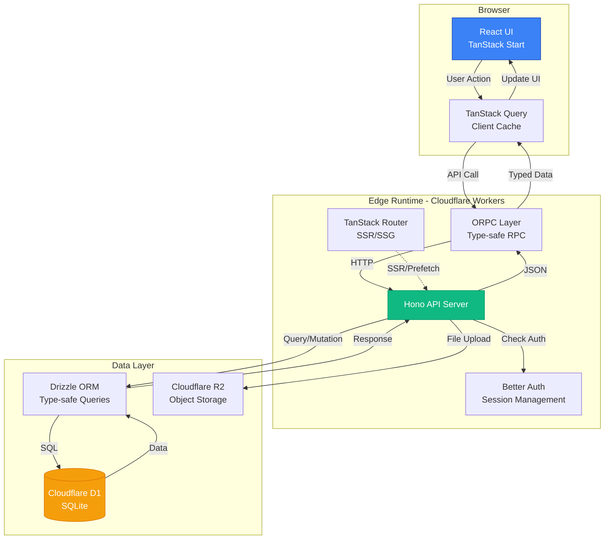
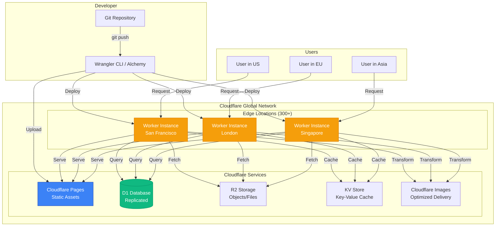
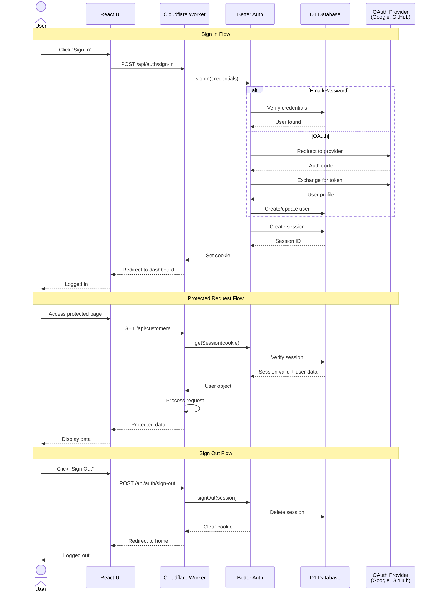
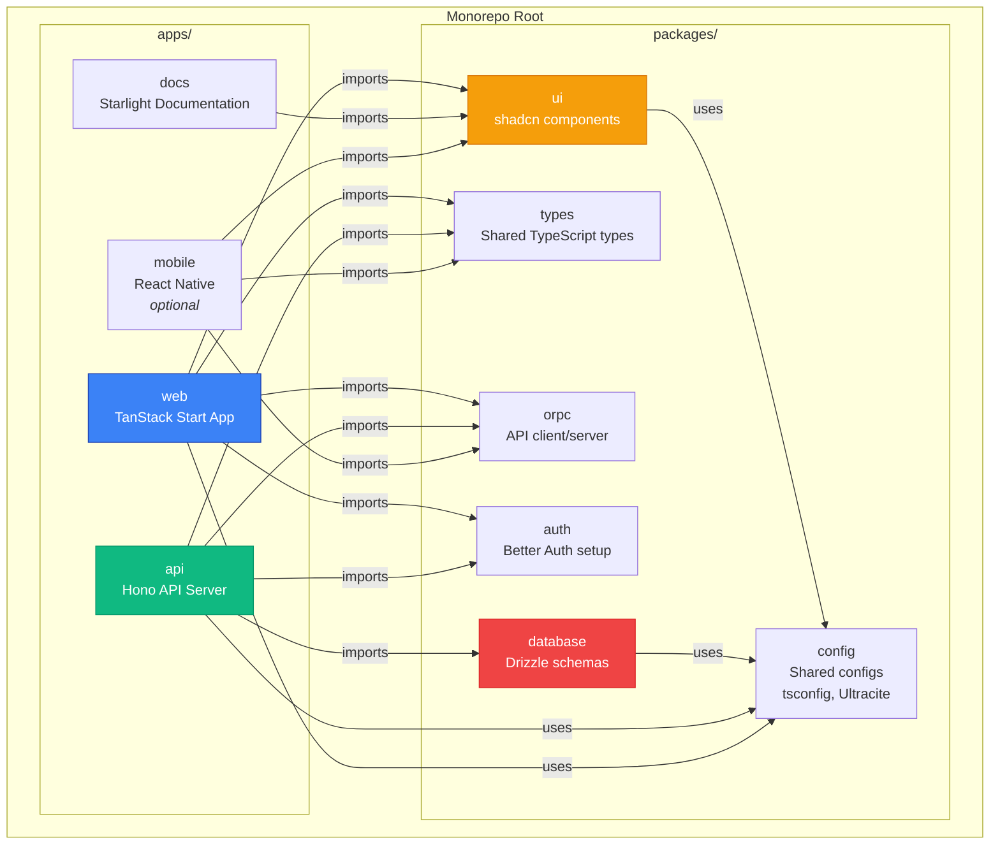
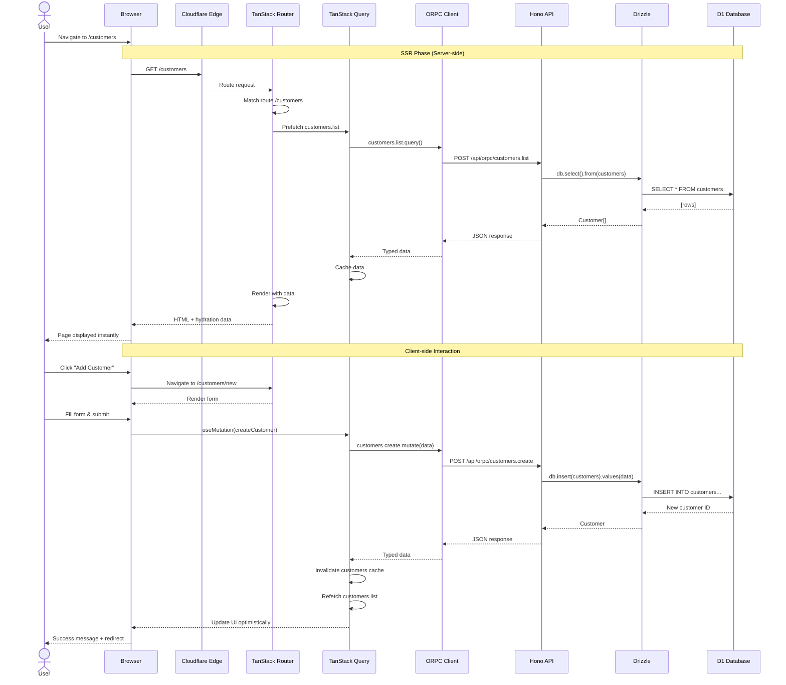
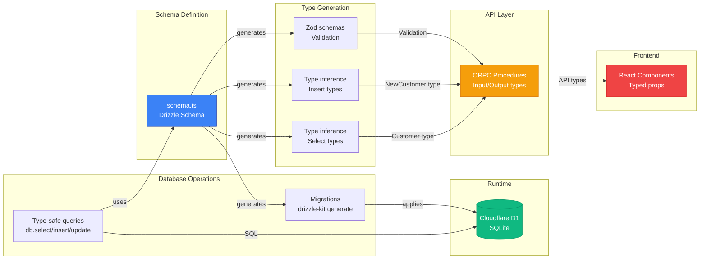

# Fenod Stack Architecture

This document provides visual architecture diagrams and explanations of how the Fenod Stack components interact.

---

## Table of Contents

- [Full-Stack Data Flow](#full-stack-data-flow)
- [Cloudflare Edge Deployment](#cloudflare-edge-deployment)
- [Authentication Flow](#authentication-flow)
- [Monorepo Structure](#monorepo-structure)
- [Request Lifecycle](#request-lifecycle)
- [Database Layer](#database-layer)

---

## Full-Stack Data Flow

This diagram shows how data flows through a typical Fenod Stack application, from the user interface to the database and back.



**Key Points:**
- **Type Safety**: Types flow from database schema → Drizzle → ORPC → TanStack Query → React components
- **Edge Runtime**: Everything runs on Cloudflare's global network for low latency
- **Caching**: TanStack Query provides intelligent client-side caching
- **SSR Support**: TanStack Router can pre-fetch data on the server

---

## Cloudflare Edge Deployment

This diagram illustrates how applications are deployed across Cloudflare's global edge network.



**Key Points:**
- **Global Distribution**: Code runs in 300+ data centers worldwide
- **Automatic Routing**: Users are routed to the nearest edge location
- **Zero Cold Starts**: Workers spin up in <1ms
- **Unified Platform**: All services (compute, storage, database) in one ecosystem

---

## Authentication Flow

This diagram shows how Better Auth handles user authentication and session management.



**Key Points:**
- **Session-based**: Uses secure HTTP-only cookies
- **Multiple Providers**: Supports email/password, OAuth, magic links
- **Database Sessions**: Sessions stored in D1 for consistency across edge locations
- **Type-safe**: Full TypeScript support for user objects and session data

---

## Monorepo Structure

This diagram shows the recommended structure for a Turborepo-based Fenod Stack monorepo.



**Key Points:**
- **Apps**: Deployable applications (can be deployed independently)
- **Packages**: Shared code used across apps
- **Turborepo**: Intelligent build caching and task orchestration
- **Type Sharing**: Database types flow from `database` package to all consumers

**Example `package.json` structure:**
```json
{
  "name": "my-fenod-project",
  "private": true,
  "workspaces": ["apps/*", "packages/*"],
  "scripts": {
    "dev": "turbo dev",
    "build": "turbo build",
    "lint": "turbo lint"
  }
}
```

---

## Request Lifecycle

This diagram shows the complete lifecycle of a request in a Fenod Stack application.



**Key Points:**
- **SSR First**: Initial page load is server-rendered for fast FCP
- **Progressive Enhancement**: Client-side navigation for instant transitions
- **Optimistic Updates**: UI updates before server confirms (then rolls back if error)
- **Smart Caching**: TanStack Query prevents redundant requests

---

## Database Layer

This diagram shows how Drizzle ORM provides type-safe database access.



**Example Type Flow:**

```typescript
// 1. Define schema
export const customers = sqliteTable('customers', {
  id: integer('id').primaryKey({ autoIncrement: true }),
  name: text('name').notNull(),
  email: text('email').notNull(),
})

// 2. Infer types
export type Customer = typeof customers.$inferSelect
export type NewCustomer = typeof customers.$inferInsert

// 3. Use in ORPC procedure
export const getCustomer = procedure
  .input(z.object({ id: z.number() }))
  .output(z.custom<Customer>())
  .query(async ({ input, ctx }) => {
    const [customer] = await ctx.db
      .select()
      .from(customers)
      .where(eq(customers.id, input.id))
    return customer
  })

// 4. Use in React component (fully typed!)
function CustomerDetail({ id }: { id: number }) {
  const { data: customer } = useQuery({
    queryKey: ['customer', id],
    queryFn: () => api.customers.get.query({ id })
  })

  // customer is typed as Customer
  return <div>{customer?.name}</div>
}
```

**Key Points:**
- **Single Source of Truth**: Schema defines database structure and TypeScript types
- **Compile-time Safety**: TypeScript catches type errors before runtime
- **Runtime Validation**: Zod validates data at API boundaries
- **Zero Code Generation**: Types are inferred, not generated

---

## Performance Characteristics

### Cold Start Times

| Service | Cold Start | Notes |
|---------|-----------|-------|
| Cloudflare Workers | <1ms | Isolates, not containers |
| D1 Database | ~50ms | First query after worker spawn |
| R2 Storage | ~100ms | First object fetch |

### Request Latency (p50)

| Operation | Latency | Notes |
|-----------|---------|-------|
| Static asset (Pages) | ~20ms | Cached at edge |
| API call (Worker + D1) | ~80ms | Including database query |
| OAuth redirect | ~200ms | Third-party provider time |
| Image transformation | ~150ms | Cloudflare Images |

### Scalability

- **Concurrent requests**: Unlimited (auto-scaling)
- **Database connections**: Pooled automatically by D1
- **File storage**: Unlimited (R2)
- **Geographic distribution**: 300+ locations automatically

---

## Security Architecture

```mermaid
graph TB
    subgraph "Client Security"
        CSP[Content Security Policy]
        HTTPS[HTTPS Only]
        Cookies[HTTP-only Cookies]
    end

    subgraph "Edge Security"
        WAF[Cloudflare WAF]
        RateLimit[Rate Limiting]
        DDoS[DDoS Protection]
    end

    subgraph "Application Security"
        Auth[Better Auth<br/>Session Management]
        CSRF[CSRF Protection]
        Validation[Input Validation<br/>Zod schemas]
    end

    subgraph "Data Security"
        Encryption[Data Encryption<br/>at rest & in transit]
        Secrets[Cloudflare Secrets<br/>Environment variables]
        RBAC[Role-based Access]
    end

    Client -->|Protected by| CSP
    Client -->|Enforced| HTTPS
    Client -->|Secure sessions| Cookies

    Edge -->|Filters| WAF
    Edge -->|Limits| RateLimit
    Edge -->|Blocks| DDoS

    App -->|Authenticates| Auth
    App -->|Prevents| CSRF
    App -->|Sanitizes| Validation

    Data -->|Encrypted| Encryption
    Data -->|Protected| Secrets
    Data -->|Enforces| RBAC

    style CSP fill:#3b82f6,stroke:#1e40af,color:#fff
    style Auth fill:#10b981,stroke:#059669,color:#fff
    style Encryption fill:#f59e0b,stroke:#d97706,color:#fff
```



**Security Best Practices:**
1. **Never commit secrets** - Use Cloudflare Secrets or Alchemy for environment variables
2. **Validate all inputs** - Use Zod schemas on all ORPC procedures
3. **Use HTTPS only** - Cloudflare enforces TLS 1.3+
4. **Implement CSRF protection** - Better Auth handles this automatically
5. **Rate limit APIs** - Use Cloudflare Rate Limiting for public endpoints
6. **Audit dependencies** - Run `npm audit` regularly, use Ultracite for linting

---

## Next Steps

- **[Development Strategy](development-strategy.md)** - Learn the UI-first workflow
- **[Troubleshooting](troubleshooting.md)** - Common issues and solutions
- **[Local Development](local-development.md)** - Docker Compose setup
- **[Architecture Decisions](decisions/)** - Why we chose each technology

---

**Last Updated:** November 2025
