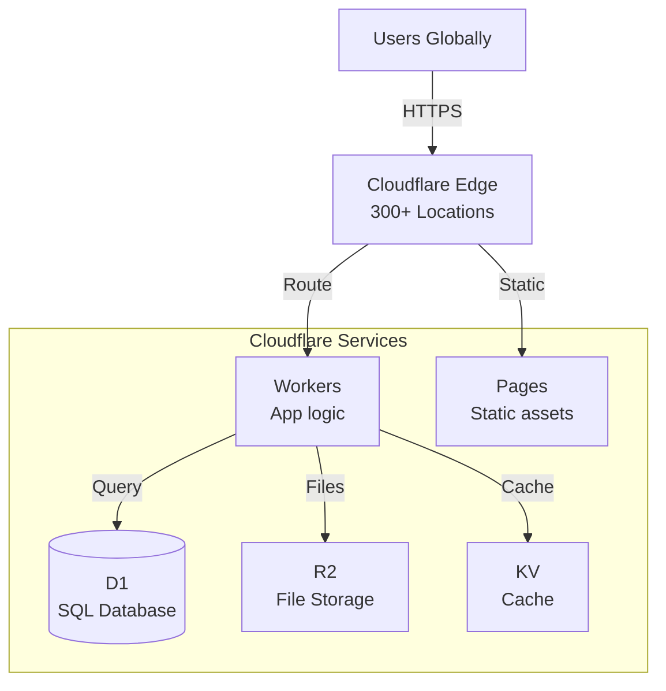

# ADR-004: Cloudflare over Vercel/AWS

**Status:** Accepted

**Date:** October 2025

**Deciders:** Fenod Technical Team

---

## Context

We needed to choose a cloud infrastructure platform that provides:

- Global edge network for low latency
- Serverless compute with minimal cold starts
- Integrated database, storage, and CDN
- Competitive pricing
- Excellent developer experience
- Strong TypeScript/modern web support

### Considered Alternatives

1. **Vercel** - Optimized for Next.js, great DX
2. **Cloudflare** - Edge-first, integrated platform
3. **AWS** - Most comprehensive cloud services
4. **Netlify** - JAMstack focused, simple deployment

---

## Decision

We chose **Cloudflare** as our primary infrastructure provider.

---

## Rationale

### 1. **True Edge Computing**

Cloudflare Workers run in 300+ locations globally, closer to users than competitors:

| Provider | Edge Locations | Cold Start | Runtime |
|----------|----------------|------------|---------|
| Cloudflare Workers | 300+ | <1ms | V8 Isolates |
| Vercel Edge | 80+ | ~50ms | V8 Isolates |
| AWS Lambda@Edge | 400+ | 100-500ms | Containers |
| Netlify Edge | 80+ | ~50ms | Deno |

**Cloudflare's advantage:**
- More locations = lower latency globally
- V8 Isolates (not containers) = instant cold starts
- Code runs at the edge, not in regions

### 2. **Cost Efficiency**

Cloudflare's pricing is significantly more affordable:

#### Free Tier Comparison

| Feature | Cloudflare | Vercel | AWS |
|---------|------------|--------|-----|
| Requests | 100K/day | 100K/month | 1M/month (Lambda) |
| Bandwidth | Unlimited | 100GB/month | 1GB/month (free) |
| Database Reads | 5M/day | N/A (external) | Charges per request |
| Storage | 10GB (R2) | N/A (external) | 5GB (S3) |
| Compute Time | 10ms avg free | Limited | 400K GB-seconds |

#### Paid Tier Comparison (Estimated Monthly Cost for 10M requests)

| Provider | Cost | Notes |
|----------|------|-------|
| Cloudflare | ~$5-25 | Workers + D1 + R2 |
| Vercel | ~$20-100+ | Pro plan required |
| AWS | ~$50-200+ | Lambda + RDS + S3 + CloudFront |

Cloudflare provides better value, especially for high-traffic applications.

### 3. **Integrated Ecosystem**

Cloudflare provides a complete platform:

```
Cloudflare Stack:
├── Workers (Compute)
├── Pages (Static hosting)
├── D1 (SQL database)
├── R2 (Object storage)
├── KV (Key-value cache)
├── Durable Objects (Stateful compute)
├── Images (Image optimization)
├── Stream (Video streaming)
├── Email (Email routing)
├── Analytics (Built-in metrics)
├── WAF (Security)
└── Zaraz (Tag management)
```

**Benefits:**
- Single bill, single dashboard
- Services work seamlessly together
- No network latency between services
- Unified authentication

Vercel requires external services for database, storage, etc., adding complexity and cost.

AWS has all services but requires extensive configuration and integration work.

### 4. **Developer Experience**

Cloudflare's DX rivals Vercel:

```bash
# Deploy in one command
wrangler deploy

# Stream logs
wrangler tail

# Local development
wrangler dev

# Secrets management
wrangler secret put API_KEY
```

**Modern tooling:**
- Wrangler CLI (like Vercel CLI)
- TypeScript-first
- Git integration
- Preview deployments
- Instant rollbacks

**Alternative:** Use [Alchemy](https://alchemy.run) for even better Cloudflare DX.

### 5. **No Vendor Lock-in (Standards-Based)**

Cloudflare Workers use web standards:

```tsx
// Standard Request/Response objects
export default {
  async fetch(request: Request, env: Env): Promise<Response> {
    return new Response('Hello World')
  }
}
```

Not proprietary APIs like Vercel's Edge Config or AWS-specific services.

**Benefits:**
- Code is portable
- Uses standard Web APIs (Fetch, WebCrypto, Streams)
- Can migrate to other edge platforms more easily
- Skills transfer to other platforms

### 6. **Performance Characteristics**

| Metric | Cloudflare | Vercel | AWS Lambda |
|--------|------------|--------|------------|
| Cold Start | <1ms | ~50ms | 100-500ms |
| Request Latency (p50) | 15-30ms | 50-100ms | 100-300ms |
| Max Request Time | 30s (paid), 10s (free) | 10s (hobby), 60s (pro) | 15 min |
| Concurrent Requests | Unlimited | Limited by plan | 1000 default |
| Memory | 128MB | Varies | 128MB-10GB |

Cloudflare's instant cold starts provide consistently low latency.

### 7. **Built-in Security**

Cloudflare includes enterprise security features for free:

- DDoS protection (unlimited)
- WAF (Web Application Firewall)
- Bot protection
- Rate limiting
- SSL/TLS certificates
- Zero Trust access

Vercel and AWS charge extra for similar features.

### 8. **Global Database Replication**

D1 automatically replicates data globally:

- Writes go to primary region
- Reads served from nearest replica
- No manual configuration
- Included in pricing

Vercel requires external database (PlanetScale, Supabase) with separate costs.
AWS requires complex RDS Multi-AZ or Aurora Global setup.

---

## Consequences

### Positive

✅ **Performance**: Sub-1ms cold starts, global edge execution

✅ **Cost**: Significantly cheaper than competitors, especially at scale

✅ **Simplicity**: Integrated platform reduces complexity

✅ **DX**: Modern CLI, great TypeScript support, instant deployments

✅ **Security**: Enterprise-grade security included

✅ **Scalability**: Unlimited concurrent requests, automatic scaling

✅ **Standards**: Uses Web APIs, less vendor lock-in

### Negative

❌ **Compute Limits**: 10s execution time on free tier (30s paid)

❌ **Bundle Size**: 1MB worker size limit (can use multiple workers)

❌ **Database**: D1 is newer, less mature than RDS/PlanetScale

❌ **Ecosystem**: Smaller than AWS, fewer third-party integrations

❌ **Node.js**: Limited Node.js API support (edge runtime restrictions)

### Mitigations

1. **Compute Limits**: Most requests complete in <100ms; use Durable Objects for long tasks
2. **Bundle Size**: Split into multiple workers; use dynamic imports
3. **Database**: D1 is production-ready; use PostgreSQL on other providers if needed
4. **Ecosystem**: Core needs are met; can integrate with external services via API
5. **Node.js**: Use edge-compatible libraries; most modern packages work

---

## When Vercel Might Be Better

Consider Vercel if:

- Your team is heavily invested in Next.js App Router
- You need Server Components streaming (though TanStack Start will add this)
- You want Vercel's specific integrations (Vercel Analytics, etc.)
- You prefer Vercel's dashboard UX
- Budget is not a concern

**Note:** You can still deploy TanStack Start to Vercel if needed.

---

## When AWS Might Be Better

Consider AWS if:

- You need AWS-specific services (SageMaker, Redshift, etc.)
- You require compliance certifications AWS has
- You need very long-running compute (>30s)
- Your organization has AWS credits or commitments
- You need maximum control and customization

---

## When Netlify Might Be Better

Consider Netlify if:

- You're building primarily static sites
- You need Netlify's specific features (Forms, Identity)
- You prefer their simpler platform
- You want built-in A/B testing

---

## Cost Projection Example

### Application: SaaS with 10M requests/month

#### Cloudflare ($25/month)

```
Workers: $5/month (10M requests)
D1: $10/month (50M reads, 500K writes)
R2: $5/month (100GB storage, 10M requests)
Pages: Free (static assets)
Total: ~$25/month
```

#### Vercel ($150/month)

```
Pro Plan: $20/month (team)
Edge Functions: $40/month (10M requests)
Bandwidth: $40/month (500GB)
Database (external): $50/month (PlanetScale)
Storage (external): $25/month (S3 or similar)
Total: ~$175/month
```

#### AWS ($200/month)

```
Lambda: $20/month (10M requests, 128MB)
API Gateway: $35/month (10M requests)
RDS: $100/month (smallest instance)
S3: $25/month (100GB + requests)
CloudFront: $20/month (CDN)
Total: ~$200/month
```

**At scale (100M requests/month):**
- Cloudflare: ~$100-150
- Vercel: ~$500-1000
- AWS: ~$800-1500

---

## Implementation Notes

### Architecture on Cloudflare



### Deployment Strategy

```bash
# Production deployment
wrangler deploy

# Preview deployment (automatic on PR)
wrangler deploy --env preview

# Rollback
wrangler rollback

# View logs
wrangler tail --env production
```

### Regional Database Strategy

For applications needing strong consistency:

```tsx
// Configure D1 with primary region
// wrangler.toml
[[d1_databases]]
binding = "DB"
database_name = "prod-db"
database_id = "xxx"
# Writes go to primary, reads from nearest replica
```

---

## Migration Path

### From Vercel

1. Deploy Workers to Cloudflare
2. Move static assets to Cloudflare Pages
3. Migrate database to D1 or PostgreSQL on other provider
4. Update DNS to point to Cloudflare
5. Test and verify
6. Decommission Vercel deployment

Most code works without changes if using web standards.

### From AWS

1. Containerize Lambda functions → Workers
2. RDS → D1 or keep PostgreSQL
3. S3 → R2
4. CloudFront → Cloudflare CDN (automatic)
5. Update DNS
6. Gradually migrate traffic

---

## References

- [Cloudflare Workers Docs](https://developers.cloudflare.com/workers/)
- [Cloudflare D1 Docs](https://developers.cloudflare.com/d1/)
- [Wrangler CLI](https://developers.cloudflare.com/workers/wrangler/)
- [Pricing Comparison](https://workers.cloudflare.com/works)
- [Alchemy (Deployment Tool)](https://alchemy.run)

---

**Last Updated:** November 2025
